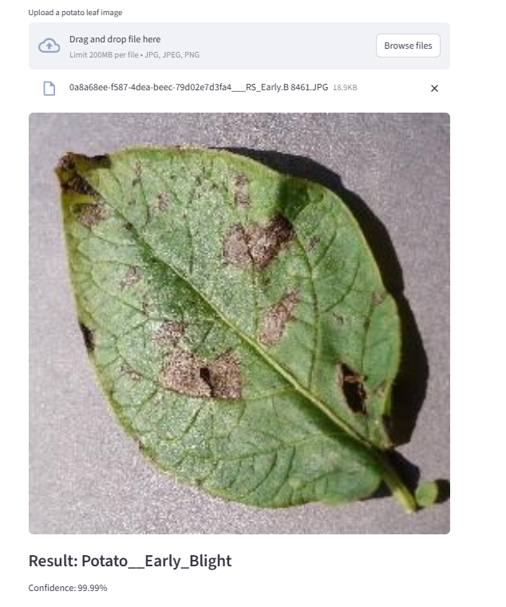

# 🥔 Potato Disease Classification

A deep learning web app that classifies potato leaf diseases from images using a custom CNN built with TensorFlow and deployed with Streamlit.

## Demo

Upload a potato leaf photo and get an instant prediction:



## Classes

The model detects 3 conditions:

| Class        | Description                                                  |
| ------------ | ------------------------------------------------------------ |
| Early Blight | Caused by _Alternaria solani_ — dark spots with yellow rings |
| Late Blight  | Caused by _Phytophthora infestans_ — water-soaked lesions    |
| Healthy      | No disease detected                                          |

## Project Structure

```
plant-disease-classification/
├── main.py           # Streamlit web app
├── model.py          # CNN training script
├── modelsaved.keras  # Trained model (see Download section)
├── requirements.txt
└── .gitignore
```

## Getting Started

### 1. Clone the repo

```bash
git clone https://github.com/Anushkap-lab/plant-disease-classification.git
cd plant-disease-classification
```

### 2. Install dependencies

```bash
pip install -r requirements.txt
```

### 3. Download the dataset

Download the [PlantVillage dataset from Kaggle](https://www.kaggle.com/datasets/arjuntejaswi/plant-village) and place it in the project folder:

```
plant-disease-classification/
└── PlantVillage/
    ├── Potato___Early_blight/
    ├── Potato___Late_blight/
    └── Potato___healthy/
```

### 4. Train the model _(optional — skip if using saved model)_

```bash
python model.py
```

This saves `modelsaved.keras` in the project folder.

### 5. Run the app

```bash
streamlit run main.py
```

## Model Architecture

Custom CNN trained from scratch:

- 5 × Conv2D layers with ReLU activation
- MaxPooling after each Conv2D layer
- Data augmentation (flip, rotation, zoom, brightness, contrast)
- Input normalization via `Rescaling(1./255)`
- Dropout (0.5) for regularization
- Dense output layer with Softmax (3 classes)

**Dataset:** PlantVillage (potato subset) — 80/10/10 train/val/test split

## Tech Stack

- Python
- TensorFlow / Keras
- Streamlit
- NumPy
- Pillow

## Requirements

```
streamlit==1.47.0
tensorflow-cpu==2.19.0
numpy==2.1.3
```
